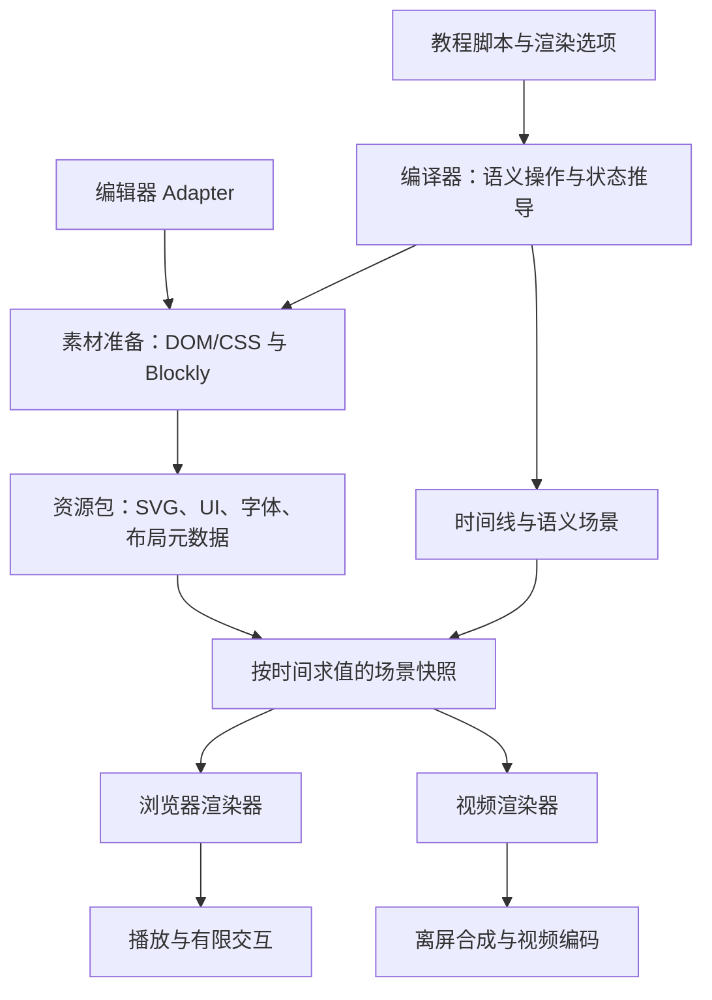

# Blockdia Motion 架构与实施计划

状态：P0、P1a 编辑器布局基线、P1b 通用教程闭环和 P1c Target/完整 toolbox 已完成（2026-09-12），见 [P0 验证记录](p0.md)、[P1a 基线](p1a.md) 和 [P1b 验收与支持矩阵](p1b.md)。P1c 已完成真实目录提取与 target 隔离，见 [P1c 验收记录](p1c.md)；P2 及后续内容仍为实施计划，不代表已有实现。

## 1. 产品目标与范围

Blockdia Motion 是一个用代码描述教程内容、操作顺序和动画的教程视频生成器，面向 TurboWarp / Blockdia IDE 的常规代码编辑流程。作者描述“拖出某块积木、接到某块积木下方、输入参数、切换分类”等动作，系统生成可定位时间播放的浏览器演示和视频。

借鉴 Remotion 的代码驱动、时间线与可重复渲染思路，不预设依赖 Remotion，也不要求录制真实编辑器操作。

首期包含：

- 编辑器外壳、分类栏、toolbox、代码工作区。
- 常规积木的显示、拖动、连接、拆分、删除、参数修改与选中/高亮。
- 鼠标移动、点击、拖动反馈、文本输入与模拟输入法候选层。
- 浏览器播放、暂停、跳转，以及有限的工作区拖动、缩放和渲染选项调整。
- 同一份教程的确定性离线视频导出。

首期不包含：

- Scratch 程序执行、项目真实运行结果、完整的交互式 IDE。素材准备可使用真实编辑器/VM 的项目与 target 数据模型来生成 toolbox，不启动项目执行。
- 舞台内容、造型编辑器、声音编辑器；保留布局插槽和空白占位。
- 任意扩展、所有编辑器版本和所有积木状态的完整兼容。
- 可视化时间线编辑器、真实系统输入法录制、多人编辑。

编辑器布局与样式以固定版本的 TurboWarp 为视觉基准：主要区域的位置关系、比例、颜色、字体、图标、间距和控件形态应保持一致的观感，不另行设计一套编辑器皮肤。允许为教程表达做明确的简化，不要求像素级复刻；舞台、角色及造型等未实现区域保留对应位置与占位。播放器控制栏属于 Motion 自身 UI，与编辑器画面分开。

## 2. 核心决策

| 事项 | 建议方案 | 理由 |
| --- | --- | --- |
| 工程结构 | TypeScript + pnpm monorepo | 共享类型和编译产物，同时隔离运行时依赖 |
| 播放与导出 | 共用场景协议，分开渲染后端 | 浏览器交互和批量帧合成有不同需求 |
| 动画模型 | 语义脚本编译为可按时间求值的时间线 | 支持任意跳转、并行导出、可重复输出 |
| Blockly 生命周期 | 只在素材准备阶段使用 | 播放和逐帧导出不依赖活动 workspace |
| 素材单位 | 静态积木/积木栈 SVG + 布局与语义元数据 | 可复用静态视觉，动画主要修改变换和透明度 |
| 状态覆盖 | 编译时收集实际需求，按需生成与缓存 | 积木组合、文本、语言和主题无法全面穷举 |
| UI 来源 | 从编辑器提取 DOM/CSS，整理为受控 UI 模板 | 保留风格，同时降低布局和资源的不确定性 |
| 作者接口 | 积木 ID、字段名、连接槽、语义 UI 目标 | 避免布局变化导致坐标脚本失效 |
| 编辑器差异 | adapter 提供选择器、字段与连接映射 | 编辑器专有知识不进入通用时间线与渲染器 |
| 首期编辑器 | 固定版本的 TurboWarp，后续适配 Blockdia | Blockdia 仍快速迭代，先减少来源变化 |
| 教程格式 | JSON 可序列化教程协议 + TypeScript 构建 API | 两种入口共用编译器与能力集 |
| 合法性 | Motion 校验教程契约，adapter 调用目标 Blockly 校验编辑规则 | 不重复实现编辑器规则 |
| SVG 样式 | 结构与主题样式分离 | 颜色主题切换复用几何资源 |

“不使用坐标”约束的是教程作者接口。布局器与渲染器内部仍然使用坐标、矩阵、边界框；这些数值从语义目标和布局自动计算。

## 3. 总体架构



教程编译需要经过“推导编辑状态 → 收集素材 → 生成素材与布局 → 解析动画锚点 → 输出时间线”的流程。不能在还不知道文本宽度与积木形状时就固定拖动终点。

核心运行时不引用 Blockly、真实编辑器 DOM、视频编码器或浏览器框架。适配、素材准备、场景求值、呈现和编码分别承担独立职责。

## 4. 场景、时间线与语义操作

### 4.1 时间模型

采用显式时长、串行/并行片段、缓动与标签的编排方式。脚本在编译阶段执行一次，不能把真实 `setTimeout`、DOM 动画事件或逐帧累积状态作为时间来源。

运行时提供概念接口 `evaluate(t, compiledScene, renderContext)`。相同资源、上下文和时间应产生相同的场景快照，直接跳转到第 10 秒与从第 0 秒播放到第 10 秒的结果一致。导出以 `t = frameIndex / fps` 采样，定义半开时间区间，避免末帧重复。

浏览器拖动等临时交互作为独立覆盖状态传入，不回写教程时间线。真实时钟只用于计算当前播放位置。

### 4.2 场景结构

场景需要包含：

- 编辑器逻辑画布尺寸、区域布局、裁剪、图层顺序。
- 项目与 target 上下文：稳定 target ID、舞台/角色类型、当前编辑 target，以及生成 toolbox 所需的变量、列表、自定义积木和资源元数据。
- 每个 target 独立的积木逻辑图：ID、opcode、字段、输入、连接和所属脚本；工作区视口与 toolbox 状态按 target 保存。
- 可视节点：资源引用、变换、透明度、可见性与交互边界。
- 稳定语义锚点：积木中心、字段区域、上下连接点、输入槽、UI 控件。
- 工作区/工具箱视口，以及鼠标、输入框、输入法候选层等独立节点。

积木逻辑 ID 在变换和状态切换之间保持稳定。资源 ID 由视觉状态决定，一个积木可以先后引用多个 SVG 资源。

### 4.3 建议的作者 API 形态

以下仅用于说明意图，不作为已确定的公开 API：

```ts
const tutorial = defineTutorial({
  adapter: 'turbowarp',
  viewport: { width: 1280, height: 720 },
  defaults: { theme: 'light', locale: 'zh-CN' },
  build(scene) {
    const start = scene.ref('start');
    const move = scene.ref('move');

    scene.sequence(
      scene.dragFromToolbox('events.whenFlagClicked', {
        id: 'start', to: scene.workspace.slot('main'),
      }),
      scene.dragFromToolbox('motion.moveSteps', {
        id: 'move', to: start.connection('next'),
      }),
      scene.type(move.field('steps'), '20', { duration: 0.8 }),
      scene.highlight(move, { duration: 0.5 }),
    );
  },
});
```

`events.whenFlagClicked` 和 `motion.moveSteps` 是 adapter/toolbox 目录注册的稳定条目键，不是显示文本或单纯 opcode。同一种 opcode 可以有多个不同默认参数、输入或 mutation 的条目。拖出操作复制所引用条目的完整定义，无需作者重复填写积木内容；`id` 指定新工作区实例的稳定 ID。引用句柄本身不创建积木，编译器检查使用时实例是否已经存在。

`dragFromToolbox` 是包含前置动作的复合操作：解析条目 → 必要时切换分类 → 滚动使条目及抓取锚点可见 → 移动鼠标并拖出 → 放置/连接。已经可见时省略分类切换和滚动。前置动作有确定时长并计入时间线，跳转与视频导出均可还原。条目不存在或不可用时报告错误，不猜测相近积木。超出可视区域的大条目至少保证可抓取区域可见。

保留 `toolbox.selectCategory`、`toolbox.reveal(entryKey)`、按语义条目设置滚动位置等底层编排接口，供讲解 toolbox 本身及未来细粒度控制使用。显式选择分类不能代替拖出前的可见性检查。

同时保留手动积木定义和创建接口，服务于粘贴、初始场景、程序化插入等不来自 toolbox 的行为，例如：

```ts
const fragment = scene.defineBlocks({
  blocks: [{ id: 'pastedMove', opcode: 'motion_movesteps', inputs: {
    STEPS: { shadow: { opcode: 'math_number', fields: { NUM: '30' } } },
  } }],
});
scene.sequence(
  scene.paste(fragment, { to: scene.workspace.slot('secondary') }),
);
```

该数据形态也只是草案；具体 opcode、shadow 和字段结构由目标 adapter 验证。`defineBlocks` 仅声明数据，`create`/`paste` 操作才在指定时间生成实例；粘贴表现由 `paste` 封装。手动创建可直接提供完整定义，不要求先注册 toolbox 条目。重复实例 ID 必须显式重新映射。

`workspace.slot('main')` 是布局中命名的放置位置，不是作者提供的屏幕坐标。

选择器支持限定在 adapter 注册的语义目标中，例如 `ui('file-menu')`。真实 CSS selector 的查询仅发生在 UI 提取或素材准备时，播放和视频后端使用解析后的节点与锚点。禁止在教程正文中散布编辑器专有 selector。

无效 ID、未支持操作、缺失字段、连接冲突和无法解析的目标应在编译时报告，并定位到对应步骤。并行动作修改同一字段/连接时应拒绝或要求显式排序，不隐式依赖调用先后。

### 4.4 合法性校验的责任

不自行重写 Blockly 的完整积木规则，也不完全忽略合法性：

- **Motion 负责教程契约**：JSON 结构、ID 唯一性、引用与生命周期、操作支持范围、时间线写入冲突，以及资源是否齐全。
- **adapter 在准备阶段调用目标 Blockly**：使用对应版本的积木定义、字段 validator 和连接检查机制，验证实例化、字段提交与连接操作，并将失败翻译为教程步骤诊断。具体调用入口在 P0 检查 TurboWarp 使用的分支后确定，不假设与最新版上游 Blockly 相同。
- **不做程序语义验证**：不判断程序是否正确、是否能达到教学目标或运行结果是否符合预期。

字段可能被编辑器规范化，准备器应读取并记录提交后的实际值；教程要求与结果不符时给出明确诊断。输入中的暂态字符串属于文本输入叠加层，到提交步骤才交给字段校验，避免把尚未输入完成的内容当成最终字段值。

不合法的连接不能静默编译成已连接状态。需要演示失败操作时，使用显式“尝试连接后退回”等表现操作，保持原逻辑图。首期不提供关闭全部校验的开关。播放和逐帧导出消费已准备的合法状态，不重复调用 Blockly。

### 4.5 TypeScript 与 JSON

两者统一落到带 `schemaVersion` 的纯数据 `TutorialSpec`，再交给同一个编译器。TypeScript API 是构建工具，可以用函数、循环和变量生成数据；函数、引用句柄和运行时闭包本身不进入 JSON。

前面的 `build(scene)` 包含函数，因此不能直接 `JSON.stringify` 原始配置就声称兼容 JSON。建议 `defineTutorial` 执行构建后返回可序列化 spec：引用转换为 ID/语义路径，串并行结构转换为步骤节点，缓动使用名称或参数化描述，不保存任意回调。

等价 JSON 片段示意：

```json
{
  "schemaVersion": 1,
  "adapter": "turbowarp",
  "viewport": { "width": 1280, "height": 720 },
  "defaults": { "theme": "light", "locale": "zh-CN" },
  "steps": [
    {
      "op": "dragFromToolbox",
      "entry": "events.whenFlagClicked",
      "id": "start",
      "to": { "kind": "workspaceSlot", "name": "main" }
    }
  ]
}
```

教程 spec 与包含资源/布局/采样轨道的编译产物分开。JSON 入口不执行代码；内置操作从首版起两种格式都能表达，采用同一 schema 校验。P1 验证 TypeScript 生成 → JSON 序列化/读取 → 编译的等价性。

## 5. 素材准备与缓存

### 5.1 Blockly 工作区与积木 SVG

素材准备器加载 adapter 对应的 Blockly 版本，在临时 workspace 中生成需要的积木与组合。等待字体与布局稳定后，导出 SVG，同时采集尺寸、连接点、字段边界、子积木关系和命中区域，最后释放 workspace。

采用两层资源：

1. **基础目录**：给定项目、target 和编辑器配置下的完整 toolbox 及其默认视觉，可预先生成。
2. **教程资源**：教程实际需要的字段文本、嵌套结构、连接组合、折叠/禁用等变体，编译时补齐。

不能只预渲染每种 opcode 的单个默认积木：文本长度、输入嵌套、C 形容器内容和连接状态都会影响几何形状。资源规划必须包含操作前后的真实结构。

建议先以完整积木栈/子树为静态渲染单位。拖动时将被拖子树作为独立资源，连接完成后切换到新的组合资源。必须保存内部积木的语义锚点，允许针对栈内积木定位。拆分、合并时隐藏旧节点并原子切换新节点，避免重复绘制和闪动。

高亮、拖动阴影、插入提示等优先作为独立叠加层；确实影响几何或无法独立表达的状态才生成变体。文本输入可预生成脚本中的中间状态；输入字符导致积木伸长时，需要更新几何与锚点，不能只覆盖一层文字。

### 5.2 Toolbox

先建立项目与 target 上下文，再调用固定版本编辑器的真实生成入口，为各 target 生成完整 toolbox。完整指该 target 在当前项目、语言、扩展与编辑器配置下实际可见的全部分类、条目、标签、分隔与按钮；不按教程引用裁减为几块积木。分类顺序、分类跳转与滚动关系也遵循真实编辑器，不能默认改成“每次只显示一个分类”。纯颜色主题共用结构。

分类栏由 UI 层绘制，toolbox 内容以独立素材和布局元数据表示，支持滚动、命中和拖动副本。可以按需缓存或虚拟化渲染，但必须保留完整内容、滚动范围与条目位置；离线导出前准备时间线中将显示的全部可视内容，不能遗漏未被拖出的背景条目。完整显示不等于全部按钮与积木编辑操作都已实现，不支持的教程操作明确报错。

从 toolbox 拖出后，源条目保留；复制当前 target 目录条目内容并分配工作区逻辑积木 ID。工具箱条目身份、工作区实例 ID 和所属 target 分开。首期不承诺任意扩展的加载与呈现；支持范围内生成完整目录，遇到无法呈现的配置明确报告，不能静默删除分类来冒充完整 toolbox。

#### Target 前置模型

教程 spec 显式声明或导入项目上下文与初始编辑 target。上下文包含舞台、角色，以及真实 toolbox 生成所需的共享/局部变量、列表、自定义积木、造型/背景/声音等元数据；具体必要字段以真实编辑器入口为准。可以提供明确的“默认空项目”构建器，但不能在 adapter 内暗藏单角色假设或臆造缺失资源。

adapter 在准备阶段分别设置真实编辑 target，再获取其 toolbox、字段选项与默认值。舞台和角色的差异、不同角色的局部数据差异都交给编辑器生成，不手写按 target 类型筛选 opcode 的规则。结构相同的资源可以去重，但目录与缓存必须记录 target 上下文及影响结果的数据版本。

提供语义化 `selectTarget(targetId)` 教程操作：切换当前 target 的代码工作区与 toolbox，保存/恢复各自视口状态。引用目标按当前 target 解析；跨 target 积木连接拒绝。该操作可先作为原子场景切换，不要求实现完整角色列表点击动画或舞台内容；观众仍不能改变 target 数据或积木。手动创建/粘贴也必须归属明确 target。

项目数据或自定义积木定义变化导致 toolbox 改变时，应准备相应上下文快照并使缓存失效。P1c 至少支持固定项目中声明的 target 及切换；运行时新增角色、变量或自定义积木的教程操作可后续扩展，不能因此省略现有数据的真实目录差异。

### 5.3 UI 的 DOM/CSS 提取

视觉基准与积木素材来源分别记录版本。首期沿用 P0 已记录的 TurboWarp scratch-gui 固定 commit，获取该版本实际编辑器在相同画布尺寸、语言、主题下的参考截图，结合源码整理布局与样式参数。参考截图、来源、配置及允许的简化项纳入文档，不能只凭印象拼出外壳。

优先对齐顶栏、代码/造型/声音标签、分类栏、toolbox、工作区、滚动条，以及舞台/角色占位区域的布局；对齐背景与积木分类颜色、字体、字号、图标、边框、圆角和主要间距。首批以 1280×720、默认主题和中文建立基线，积木大小与 toolbox 密度也应和参考画面协调。布局尺寸和样式令牌由 adapter 的受控配置提供，语义锚点从该布局生成。

提取编辑器静态外壳所需的 DOM、样式、图标和字体，整理为带来源与版本的受控模板。需要处理继承样式、伪元素、CSS 变量、外部资源、字体加载和区域裁剪；不能认为复制 `outerHTML` 就完成了复用。

浏览器后端使用模板渲染 UI。视频后端在素材准备阶段按尺寸、主题、语言和 UI 状态栅格化静态区域，随后合成缓存图层；按钮按下、菜单展开等有限状态可单独缓存。高频变化的文字、鼠标与提示层用通用场景节点表达。

不要求视频后端直接解释任意 DOM/CSS。若某个 UI 动画无法表示，应新增受控节点或明确限制，而不是默认回到整页逐帧截图。

视觉验收分两项：与真实 TurboWarp 参考画面对照，确认布局和样式符合基准；浏览器与视频关键帧对照，确认两条管线呈现一致。后一项不能证明前一项。允许的简化需要明确记录，如空白舞台和省略未支持的控件；不能以“大致相似”为由随意改动主要区域比例和基础样式。

### 5.4 资源包契约

资源包包含 manifest、结构 SVG、独立主题样式/令牌、UI 图层、字体、布局元数据和来源信息。结构缓存键考虑 adapter/编辑器/Blockly 版本、素材协议版本、语言、字体及几何样式、积木结构与字段、UI 尺寸；纯颜色主题不进入结构缓存键。着色与栅格缓存另包含主题版本和输出比例。

SVG 导出需处理：ID 和 `defs` 命名空间冲突、内部引用、外部图片、字体、自定义 CSS、`foreignObject` 和滤镜兼容性。SVG 保留几何、文本、必要引用及语义 class/data 属性，不内嵌外部 CSS 或写死主题颜色。将来源中的主题相关行内属性映射为样式令牌；不能直接删除所有属性，因为路径、变换、裁剪等仍是结构的一部分。不支持的元素应在准备阶段转换或报错。

浏览器以内联 SVG 配合独立且作用域隔离的样式表渲染。视频后端在准备栅格资源时解析同一组主题令牌，必要时生成临时已解析样式的 SVG，再交给绘制后端；不要求后端直接支持完整浏览器 CSS。结构源文件始终保持样式分离。

纯配色切换只更新主题样式并失效对应着色缓存，不重建 workspace、不重新布局。若主题改变字体、字号或其他几何参数，则视为布局变体，需要重新准备几何；语言切换通常也需要新的文本与布局资源。

## 6. 两条渲染管线

### 6.1 浏览器实时管线

`编译产物 → 时间求值 → DOM UI + SVG 工作区 + 叠加层`

- 播放、暂停、逐帧定位和任意跳转。
- 工作区平移/缩放使用视口变换，不创建真实 Blockly workspace。
- 点击命中使用语义边界与逆变换，正确考虑缩放、裁剪与滚动。
- 观众不能创建、拖动、连接、删除积木，也不能编辑字段；只允许播放器控制、观察视口和渲染选项调整。
- 开始平移/缩放工作区时立即暂停，冻结教程时间、鼠标与输入动画；手势结束后保持暂停。
- 作者摄像机与观众视口偏移分开；提供“回到教程视角”（仍暂停）。点击继续播放时先恢复当前时间的教程视角、清除观众偏移，再推进时间；切换教程时同样清除偏移。
- 纯颜色主题切换直接应用独立样式；语言或几何主题切换时暂停、准备对应布局和锚点，再原子切换，保留逻辑播放时间并等待观众继续。
- 已准备变体可即时切换；未准备变体显示加载过程或明确不可用，不静默混用旧资源。

浏览器预览支持自适应容器，逻辑画布尺寸保持固定。交互状态不进入视频导出；导出使用作者设定的视口与选项。

### 6.2 视频管线

`编译产物 → 固定帧采样 → 离屏图层合成 → 帧流 → 编码器`

优先验证离屏 Canvas/Skia 类绘制后端，并用 FFmpeg 类编码器输出视频；具体库在技术验证阶段选择。运行时不需要真实编辑器或活动 workspace。

静态 SVG 可按合适分辨率栅格化并缓存，逐帧只更新位置、矩阵、透明度、裁剪和少量状态。放大场景按最大预期缩放准备资源，避免低分辨率贴图模糊，也避免无上限缓存。

“不反复截图 DOM”不等于没有逐帧成本：仍需采样、合成、传输和编码。应分别测量准备耗时、冷/热缓存导出耗时、合成速度、编码速度、峰值 RSS 和缓存大小，再决定并行策略。

首期建议输出无音轨 MP4，并可保存关键帧 PNG 便于验证。后续加入音频轨道、字幕与更多编码格式。输出应记录分辨率、帧率、资源版本和渲染选项；缺失资源时失败，不输出不完整视频。

### 6.3 两端一致性

共享时间采样、布局、资源、文本内容和坐标变换；后端仅负责呈现。优先复用准备阶段测得的文本与积木几何，避免两端自行排版导致锚点偏移。

以关键帧对比验证主题、字体、透明度、裁剪和层级。接受抗锯齿等小差异，不能接受文字缺失、连接错位或动画时序不同。首期即可加入视频兼容性样例，避免浏览器完成后才发现 SVG 无法导出。

## 7. 模块边界与 monorepo

以下是逻辑边界，可以先合并少量包，按需求拆分，不要求第一天全部发布：

```text
apps/
  playground/           浏览器预览、选项和交互演示
packages/
  core/                 场景协议、时间线、纯求值与布局契约
  authoring/            编排 API、编译、需求收集、诊断
  adapter-turbowarp/     编辑器映射、素材准备接口实现
  asset-builder/        Blockly/UI 提取、规范化、缓存与 manifest
  renderer-browser/    DOM/SVG 呈现、交互与播放控制
  renderer-video/      离屏合成、帧调度与编码
  cli/                  准备、校验、预览、导出入口
examples/
  basic-editing/        贯穿各阶段的基准教程
docs/
```

在场景与后端内部进一步划分独立组件：`EditorChrome`、`Toolbox`、`Blocks`、`Cursor`、`TextInput`、`IMEOverlay`、`Annotations`。各组件声明资源需求、输出节点和语义锚点，通过场景协议协作，不直接修改其他组件的 DOM。

文本输入与输入法层只表现教程声明的输入过程，区分预编辑文本、候选项与提交结果；不依赖操作系统的真实输入法。候选框挂在字段锚点上，随工作区变换更新位置，并处理边界避让。

## 8. 实施阶段与验收

### P0：验证素材路线与两端兼容（已完成）

已提供固定版本源码构建、7 份代表性素材、独立主题、简化外壳、workspace 销毁后的浏览器播放和 1280×720 / 30 fps / 7 秒 MP4。5 组双端关键帧对比及字段/连接检查通过。候选视频后端确定为 resvg + FFmpeg；当前逐帧处理整张 SVG，静态栅格缓存仍需后续实现。具体来源、复现步骤、成本与限制见 [P0 验证记录](p0.md)。

先制作一段固定示例：从 toolbox 拖出事件帽积木与移动积木、连接、将参数从 10 改为 20。

- 检查固定版本的 TurboWarp 及其 Blockly 分支源码，确认提取入口与实际字段/连接模型。
- 导出普通积木、嵌套输入、C 形容器、长文本及中文的代表性 SVG。
- 导出一份简化编辑器外壳；舞台和造型区域留空。
- 分别在浏览器与候选视频后端绘制同一关键帧，验证结构 SVG + 独立主题样式的兼容性。
- 销毁 workspace 后完成拖动、状态切换和帧导出。

验收：浏览器与视频均能清楚呈现示例；字体、裁剪和连接点正确；记录准备/合成/编码成本与内存。若 SVG 能力不兼容，先调整资源格式或后端再扩大 API。

### P1：可求值的端到端最小版本

- **P1a：编辑器布局与样式基线（已完成，见 [验收记录](p1a.md)）。** 按 5.3 获取固定版本 TurboWarp 参考画面，整理布局参数与样式令牌，将 P0 简化外壳补齐为符合基准的默认编辑器画面；保留未实现区域占位。保存同尺寸参考图与 Motion 双端关键帧，记录允许的差异，再据此确定区域布局和语义锚点。P0 已完成的兼容性验证不等同于此项验收。
- **P1b：通用教程闭环（已完成，见 [验收记录与支持矩阵](p1b.md)）。** 已建立 TypeScript/pnpm workspace、纯数据协议、语义编译与两端共享求值，示例 6.4 秒 / 192 帧。以下工作建立在 P1a 布局上，具体支持范围以 P1b 矩阵为准。
- 建立最小 monorepo、场景协议、资源 manifest 和一个 adapter。
- 实现串行/并行、时长、缓动、稳定 ID 与连接/字段目标。
- 实现自动揭示 toolbox 条目并拖出、移动、连接、参数输入与鼠标层。
- 实现手动定义/创建与基础粘贴；由 adapter 委托 Blockly 验证编辑规则。
- 提供 JSON spec 与 TypeScript 构建入口，验证序列化前后编译等价。
- 同一编译产物支持浏览器跳转与 CLI 导出短视频。

验收：默认编辑器画面的主要区域布局与基础样式符合 TurboWarp 参考，差异有记录；示例教程无作者坐标、无编辑器 selector；随机时间求值与顺序播放一致；视频帧数与时长正确；缺失资源/目标有明确诊断。

### P1c：Target 上下文、完整 toolbox 与定义提取（已完成）

P1b 已验证通用教程闭环，但 `packages/adapter-turbowarp/src/index.ts` 的三条手写 catalog、分类中文标签/坐标及 opcode 字段/输入白名单仍是示例级实现，不代表已完成真实编辑器目录适配。本阶段已移除这套手写目录与白名单，保留 P1a 的视觉基线与 P1b 的时间线能力；实现与独立真实 GUI 对照见 [P1c 完成记录](p1c.md)。

- **先建立 target 模型**：实现 5.2 的项目上下文、初始 target、各 target 工作区归属与 `selectTarget`，贯通 TypeScript/JSON、编译产物和求值；舞台与造型内容仍留空。
- **再生成各 target 的完整 toolbox**：从固定版本 TurboWarp 的真实 toolbox 构建入口提取全部分类与条目完整定义，保留默认字段、shadow、嵌套输入、mutation 及条目差异。记录来源版本和提取上下文；动态分类依赖变量、角色或扩展时使用明确的准备上下文，不能猜测默认值。首期无需支持所有扩展。
- 分类标签来自对应语言资源或编辑器实际生成结果；分类与条目坐标来自受控布局计算或真实测量。检查 asset-builder 中散落的定位常量，把有意设计的间距/命名放置槽统一交给布局配置，取消按分类写死屏幕坐标的方式。
- 从目标 Blockly 的实际实例与定义获取字段、输入和连接信息，移除重复维护的 opcode 字段/输入白名单。最终字段提交、连接合法性仍由 Blockly 校验；Motion 继续校验教程结构、引用与操作能力。
- 区分“目录可发现”“素材可准备”和“教程操作已支持”。未实现的 mutation、字段类型或连接操作给出明确能力诊断，不为扩大目录而假称支持，也不因为缺少三条示例中的映射就拒绝普通积木。
- 保留固定源码 commit 和必要的语义别名。条目身份不能仅依赖显示文字或 opcode；生成稳定目录键并定义同 opcode 多条目的区分规则。现有公开条目键可作为指向真实条目的别名，不再携带重复的手写积木内容。
- 完整 toolbox 不得按教程用到的条目过滤。素材准备覆盖时间线中完整可视区域（包括未被操作的条目），允许虚拟化和缓存，但不能改变内容、顺序或滚动范围；工作区动画变体仍按需求准备。生成结果可缓存或纳入版本管理，但必须提供可复现生成入口、来源元数据与失效规则；不能仅把现有常量搬到 JSON。

验收：

1. 现有教程经 TypeScript/JSON 编译后仍能播放与导出，保留自动揭示和确定性求值检查。
2. 在舞台和至少两个局部数据不同的角色上，对照真实编辑器检查完整分类、条目、默认值、动态选项及滚动内容，不能只检查教程用到的积木。另选两个原 catalog 之外、现有操作模型可表达的条目，不修改业务代码或添加白名单即可提取、拖出、准备和导出。
3. 提取结果与固定版本编辑器的实际条目对照，验证默认值、shadow 和分类；覆盖同 opcode 不同定义的条目身份，并验证重新生成结果稳定。
4. 验证未知条目、无效字段/连接及未支持能力的诊断；删除对应旧白名单、重复默认值与过时测试预期。
5. 验证 target 切换及乱序求值的工作区/toolbox 隔离、局部变量不串用、跨 target 连接拒绝和上下文缓存失效；在浏览器与视频中检查完整 toolbox 的首部、中部、尾部及分类跳转。
6. 回归 P1a 布局与双端关键帧；更新 P1b 支持范围、README 和本计划，新增 P1c 完成记录，说明提取入口、上下文与剩余限制。

### P2：常规代码编辑覆盖

- 增加拆分、删除、嵌套输入、C 形容器、常见字段和高亮。
- 完成教程需求收集、组合状态缓存、toolbox 滚动与分类切换。
- 增加文本输入、模拟输入法、菜单和基础标注。
- 为支持的操作与积木列出明确矩阵，未支持能力编译时报错。

验收：多段代表性教程覆盖连接结构变化与长文本重排；无重复节点、错误锚点或切换闪烁。

### P3：浏览器有限交互与视觉变体

- 工作区平移/缩放自动暂停；继续播放前恢复教程视角；禁止观众改变积木。
- 至少两种主题与中英文资源变体。
- 扩展 P1a 视觉基线，检查不同主题、语言和容器尺寸下的区域布局、文字溢出、裁剪与样式；不将基础外壳对齐推迟到本阶段。
- 保持播放时间的选项切换、加载反馈与资源释放。

验收：交互后鼠标和输入层定位正确；选项切换不改写教程；销毁播放器后释放监听器、图层与缓存引用。

### P4：导出质量与性能

- 资源复用、有限缓存、帧流背压、取消和失败清理。
- 测量不同分辨率、帧率、教程长度、资源规模的性能。
- 增加有界并行；先验证内存预算，再决定默认并发数。
- 固定环境建立关键帧回归与长视频稳定性基线。

验收：可重复完成代表性长教程；提交可复现基准，区分素材准备、帧合成与编码，依据 P0/P1 数据设置量化预算。

### P5：后续扩展

在 TurboWarp 基础上增加 Blockdia adapter，复用共有能力并隔离 fork 差异，再考虑舞台/VM、造型编辑器、音轨/字幕、更多 UI 操作、可视化编排。新区域通过场景插槽与组件扩展，不改写核心时间模型。

## 9. 主要风险与验证策略

| 风险 | 应对与验证 |
| --- | --- |
| 积木状态数量膨胀 | 收集教程实际状态，缓存去重；记录资源体积与准备时间 |
| 连接后形状发生变化 | 保存逻辑图与完整前后组合，测试嵌套/C 形容器的锚点 |
| 字体和 SVG 后端差异 | P0 提前验证中文、长文本、滤镜与外部资源；统一字体来源 |
| UI 提取结果依赖运行环境 | 固定来源版本并整理模板，测试两端关键帧 |
| 交互视口干扰教程动作 | 将观众偏移单独建模，针对变换后的命中和光标做测试 |
| 导出内存随帧数增加 | 流式编码、有界队列与缓存；长教程观测峰值 RSS |
| 编辑器升级破坏映射 | adapter 版本与资源版本绑定，准备时验证目标存在 |
| 提取素材存在许可约束 | 记录代码、图标与字体来源，分发前核对对应许可与署名要求 |

测试优先覆盖确定性求值、语义连接、资源失效和两端关键帧，不靠大量逐字快照锁死实现细节。

## 10. 待确认项与当前默认值

本轮已明确：首版支持 TypeScript 和 JSON；观众不能改变积木，调整视口自动暂停；建议先固定 TurboWarp 版本作为适配基础。

以下其余默认值不阻碍先做 P0，确认后更新本文件：

| 问题 | 当前建议默认值 | 影响 |
| --- | --- | --- |
| 导出运行环境？ | 本地 CLI/桌面 Node 环境，暂不承诺浏览器内视频导出或服务器部署 | 编码器与资源限制 |
| 首批输出规格？ | 1280×720、30 fps、无音轨 MP4，可配置后逐步验证 | 验收样例与性能基线 |

下一步进入 P2，在 P1b 的语义协议、编译器和完整栈资源基础上增加拆分、删除、嵌套和组合状态缓存。P1b 继续复用 resvg + FFmpeg 路线；当前无静态栅格缓存的数据用于识别成本，尚不作为生产性能或并发预算。
